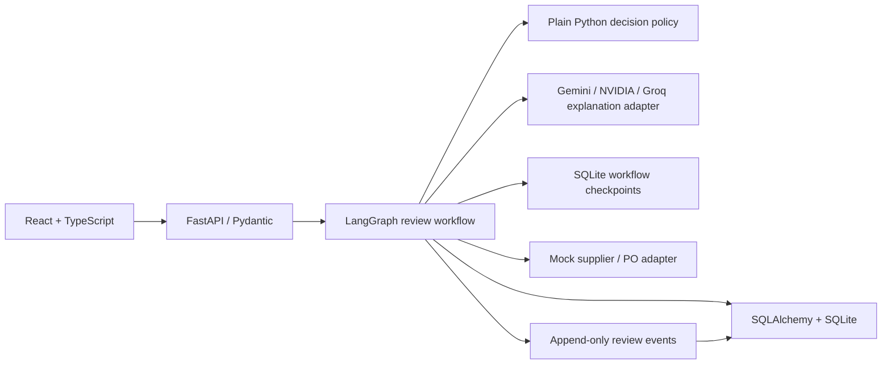

# AI Purchasing Agent

A buyer workspace for bounded, provider-native investigation of purchase recommendations, deterministic policy and supplier allocation, exact-version buyer approval, idempotent purchase-order execution, and per-order read-back validation. The main demo modifies the seeded 800-unit recommendation to 450 units; supplier shortfalls can create a validated multi-supplier recovery plan, and demand signals can open a supplemental review.

## Architecture



Gemini, with a tool-capable Groq fallback, selects from scoped read functions inside a bounded investigation. A mandatory manifest may label and fill facts omitted by a successful model round. Provider exhaustion stops safely in `NEEDS_ATTENTION`; it never becomes a manifest-only “agent” success. Python remains authoritative for quantities, constraints, supplier allocation, approvals, writes, and validation. Explanation wording has independent Gemini/Groq/NVIDIA failover and a clearly labelled deterministic template fallback. No Ollama, RAG, vector database, or multi-agent framework is required.

## Approach and safety model

The workflow treats a planner recommendation as an input to verify, not an instruction to execute. It captures inventory, forecast, confirmed inbound supply, supplier terms, budget, storage capacity, and planning policy in an evidence snapshot. The deterministic policy then calculates usable stock, inventory position, target stock, raw need, and the largest feasible MOQ-compliant order.

Every purchase-order write requires buyer approval. After approval, the workflow refreshes the volatile evidence and creates a new proposal if any operational value changed. A write uses a proposal-version idempotency key, then the system reads the persisted purchase order back and compares supplier, node, item, quantity, price, currency, status, and idempotency key before showing success. Missing, stale, conflicting, or currency-incompatible facts result in `INVESTIGATE`, never an automatic order.

## Requirements

- Python 3.11+
- `uv`
- Node.js 22+ and `pnpm`

## Run locally

From the repository root:

```bash
uv sync
cp .env.example .env
uv run alembic upgrade head
uv run uvicorn purchasing.main:app --app-dir apps/api --reload
```

In a second terminal:

```bash
pnpm --dir apps/web install
pnpm --dir apps/web dev
```

Open the Vite URL (normally `http://localhost:5173`). The API runs at `http://localhost:8000`; interactive API docs are at `/docs`. Seed fixtures are added on API startup and are safe to re-run.

Set `LLM_ENABLED=true` and provide Gemini and/or Groq credentials for the agentic investigation. Gemini is the primary tool provider and `GROQ_AGENT_MODEL` is its tool-capable fallback. Explanation wording separately follows `LLM_PROVIDER` and `LLM_FALLBACK_PROVIDERS`, including NVIDIA where configured. Keep `.env` local; never commit credentials. With `LLM_ENABLED=false`, tests use a scripted provider so correctness remains network-independent.

## Verify

```bash
uv run pytest
uv run ruff check apps/api tests
pnpm --dir apps/web test -- --run
pnpm --dir apps/web build
```

Tests use a temporary SQLite database and deterministic explanations. They set `LLM_ENABLED=false`, so they do not call paid or free-tier model APIs even if local provider keys exist. The workflow tests cover the 800-unit review, acceptance/rejection/investigation, approval, PO read-back validation, request idempotency, and partial fulfilment.

The current automated suite covers these evaluation cases:

| Scenario | Expected result | Evidence |
|---|---|---|
| 800-unit recommendation | `MODIFY` to 450, approval, validated PO | Integration workflow test |
| Exact calculated need | `ACCEPT`, then approval required for the PO | Integration workflow test |
| Existing coverage sufficient | `REJECT`, no PO | Integration workflow test |
| Stale forecast | `INVESTIGATE`, no PO | Integration workflow test |
| Buyer rejects proposal | Terminal rejection, no PO | Integration workflow test |
| Facts change after approval | Proposal is superseded and re-approved | Integration workflow test |
| MOQ, budget, storage, supplier capacity | Feasible quantity never exceeds a hard limit | Domain unit tests |
| Partial supplier confirmation | Coverage is recomputed; duplicate cumulative confirmations are ignored | Integration workflow test |

The Scenario Lab tests additionally cover conflicting inventory, overdue incoming orders, supplier quote changes after review, lost create responses, and deliberately malformed persisted purchase orders.

## Demo

1. Open the recommendation queue and select `REC-800`.
2. Start the review. Inspect its evidence, inventory position, requirement, caps, and `MODIFY 450` decision.
3. Approve the exact proposal version. The backend refreshes inputs before writing.
4. Confirm the purchase order is read back and validation passes.
5. Use “Run supplier exception demo” to submit a 250-of-500 confirmation and inspect the recomputed proposal.
6. Use Scenario Lab to reset any of five focused Scenario 1 safeguards and inspect the real workflow outcome.

See [spec/14-demo-runbook.md](spec/14-demo-runbook.md) for the detailed walkthrough and [spec/README.md](spec/README.md) for the complete implementation contract.

## What to demonstrate in the assignment

Use the 800-unit flow as the primary end-to-end scenario. It proves that the system gathers several independent facts, modifies an unsafe recommendation, requires human approval, creates exactly one PO, and validates the observed result. Then run the supplier-exception control to show that a 250-of-500 confirmation recalculates coverage before proposing another action.

Scenario 3 is implemented through versioned recent-sales and revised-forecast evidence. A confirmed spike either completes without action when coverage is sufficient, produces an approval-gated supplemental sourcing plan when full recovery is feasible, or stops in `NEEDS_ATTENTION` with an advisory partial plan when global constraints prevent full recovery. Scenario 4 constraints apply throughout Scenarios 1-3.

## Clean setup check

The documented setup assumes a new checkout with no existing local SQLite database. If you previously ran an older schema locally, move its `purchasing.db` and `checkpoints.db` aside before running the migration. Database files are ignored by Git and can be recreated from the migration and seed data.
