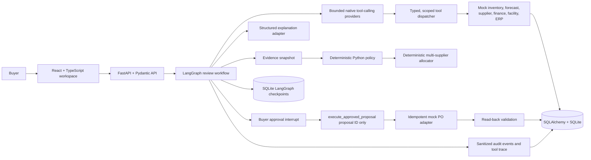

# AI Purchasing Agent

Stockwise is a local full-stack purchasing decision demo. It investigates a buyer's recommendation and operational exceptions, explains a deterministic decision, requires buyer approval for every purchase order, and checks the persisted order before reporting success.

The system demonstrates bounded agentic tool use without giving a model financial authority. Models can select approved evidence reads and, only after a buyer approves, invoke one opaque-proposal execution tool. Plain Python owns calculations, constraints, sourcing allocation, authorization, idempotency, and validation.

## What is implemented

- Scenario 1: review a recommendation and `ACCEPT`, `MODIFY`, `REJECT`, or `INVESTIGATE` it using inventory, demand, eligible incoming POs, supplier terms, budget, storage, and planning policy.
- Scenario 2: recompute coverage after supplier partial fulfilment and create a reliability-first multi-supplier recovery plan when a complete, feasible plan exists.
- Scenario 3: validate a demand-spike signal against recent sales and versioned forecasts; take no action when coverage is sufficient, otherwise prepare an approval-gated supplemental plan.
- Scenario 4: enforce hard constraints throughout review, allocation, approval, execution, and recovery.
- Scenario Lab: run repeatable safety cases and create local custom scenarios through the same workflow used by seeded recommendations.

## Architecture

The application is a modular monolith: one React/Vite frontend, one FastAPI process, one SQLite operational database, and a separate SQLite workflow-checkpoint database.



### Module boundaries

| Area | Responsibility |
|---|---|
| `apps/web` | Buyer queue, evidence and calculations, tool activity log, constraints, sourcing plans, approval, execution results, validation, and Scenario Lab controls. |
| `apps/api/purchasing/api` | HTTP routes, request/response validation, local demo role checks, and error mapping. |
| `apps/api/purchasing/workflow` | LangGraph lifecycle, bounded investigation, approval pause/resume, pre-execution refresh, action invocation, and recovery. |
| `apps/api/purchasing/application` | Typed evidence tools, provider adapters, evidence snapshots, sourcing, explanations, seeding, audit, and demo use cases. |
| `apps/api/purchasing/domain` | Framework-independent decision calculations and deterministic allocation rules. |
| `apps/api/purchasing/infrastructure` | SQLAlchemy persistence and database sessions. |
| `apps/api/migrations` | Alembic schema history. |
| `spec` | Product, architecture, policy, API, workflow, safety, evaluation, and demo contracts. |

## Agent and safety model

### Investigation

When `LLM_ENABLED=true`, Gemini (`GEMINI_MODEL`, default `gemini-3.8-flash`) is the primary native function-calling provider. The tool-capable Groq model (`GROQ_AGENT_MODEL`, default `openai/gpt-oss-120b`) is the investigation fallback. Groq Compound and NVIDIA Nemotron are explanation providers, not investigation-tool fallbacks.

The model receives only typed, phase-scoped read tools. The dispatcher validates the tool name, arguments, review scope, provider phase, duplicate calls, and retry limits. Investigation is bounded to three model rounds and ten model-selected calls. After a provider returns a non-empty call plan, a required-evidence manifest attempts any omitted or unsuccessful required reads; its calls are labeled separately from model-selected calls. If both tool-capable providers fail or return no calls, required evidence remains incomplete and the review stops safely.

The workspace's **Tool activity** log shows the tool's readable name, exact tool identifier, whether the model or manifest selected it, review scope, safe result summary or failure, provider, round, and duration. It does not expose prompts, hidden reasoning, API keys, or raw provider responses.

### Decision and action

The model cannot choose quantities or override business rules. The domain policy uses the evidence snapshot to calculate:

```text
usable_on_hand    = max(0, on_hand - reserved - damaged)
inventory_position = usable_on_hand + eligible_incoming
target_stock      = forecast_demand + safety_stock
raw_need          = max(0, target_stock - inventory_position)
```

It then applies MOQ, supplier availability, budget, storage, and evidence rules. An overdue PO is not eligible incoming supply. Conflicting, missing, or stale required evidence returns `INVESTIGATE`. Scenario 1 may present a safe constrained quantity and show the unresolved shortage; supplier-recovery and demand-recovery plans must cover the required quantity to be approved.

All PO writes require explicit buyer approval in the demo. Before execution, the workflow refreshes facts and revalidates the exact proposal version. After approval, the model sees only `execute_approved_proposal(proposal_id)`; the server reloads all PO fields from the persisted proposal. Each plan line has a stable idempotency key and is read back from the mock system of record. Completion is shown only when every order passes validation. Changed facts require renewed approval; provider exhaustion after approval waits for an authorized retry without writing.

### Provider roles

Tool-calling and explanation are configured independently:

| Purpose | Provider order | Configuration |
|---|---|---|
| Evidence investigation and approved action invocation | Gemini, then Groq agent | `GEMINI_API_KEY`, `GEMINI_MODEL`, `GROQ_API_KEY`, `GROQ_AGENT_MODEL` |
| Buyer-facing explanation | `LLM_PROVIDER`, then `LLM_FALLBACK_PROVIDERS` | Gemini structured output, Groq `GROQ_MODEL` (default `groq/compound`), NVIDIA `NVIDIA_MODEL` |
| No-network tests / deterministic local runs | Scripted tool provider and deterministic explanation template | `LLM_ENABLED=false` |

An explanation-provider failure cannot change the decision. It falls through the configured explanation providers and then to the deterministic template. Investigation-provider exhaustion is different: it is a safety/availability failure and cannot be replaced by a deterministic evidence collection path.

## Run locally

### Requirements

- Python 3.11 or later
- [`uv`](https://docs.astral.sh/uv/)
- Node.js 22 or later
- [`pnpm`](https://pnpm.io/)

From the repository root, install dependencies and prepare local configuration:

```bash
uv sync
pnpm --dir apps/web install
cp .env.example .env
```

The default `.env.example` enables model use but has empty credentials. Add the keys for providers you want to use to `.env`; keep that file local and never commit it. To run entirely without external model requests, set:

```dotenv
LLM_ENABLED=false
```

Migrate the local database:

```bash
uv run alembic upgrade head
```

Start the API in one terminal:

```bash
uv run uvicorn purchasing.main:app --app-dir apps/api --host 127.0.0.1 --port 8000 --reload
```

Start the frontend in another terminal:

```bash
pnpm --dir apps/web dev --host 127.0.0.1 --port 5173
```

Open [http://localhost:5173](http://localhost:5173). The API is at [http://127.0.0.1:8000](http://127.0.0.1:8000), interactive API docs at `/docs`, and readiness at `/health`. The API seeds repeatable demo records at startup. Operational data is in SQLite; LangGraph checkpoints use the separate `CHECKPOINT_DB` file.

`DATABASE_URL` and `CHECKPOINT_DB` are relative to the directory where the API is started. For a clean database or to preserve an existing local database, point them to new local file paths in `.env` before migrating; do not remove an existing database unless you intend to discard its local data.

## Demo walkthrough

### Main recommendation: 800 units

1. In the recommendation queue, select `REC-800` and start the review.
2. Inspect **Tool activity** to see the model-selected reads, manifest completion, any provider failover, and each safe result or failure.
3. Review the evidence sources and freshness, calculation (`raw_need`, proposed quantity, unresolved quantity), constraints, and explanation.
4. For the seeded case, the recommendation is modified from 800 units to a feasible 450-unit proposal.
5. Approve the exact proposal version. The service refreshes evidence, invokes the proposal-ID-only action tool, creates the mock PO idempotently, reads it back, and validates it.
6. Confirm the PO total and validation result in the review.

### Supplier partial fulfilment

Use **See supplier exception** from the landing area to record a supplier confirmation for the demo PO. The workflow recalculates remaining coverage instead of blindly reordering the unfulfilled balance, investigates alternate suppliers, and produces a complete approval-gated plan if feasible. Every supplier line is executed and validated independently.

### Scenario Lab

Choose a case to reset and launch its review. The visible **Reset this test case** button starts that selected case again from its intended facts.

| Case | What it demonstrates |
|---|---|
| Inventory conflict | Reserved and damaged quantities exceed on-hand stock; investigation is required and no PO is allowed. |
| Delayed incoming PO | Overdue supply does not reduce the requirement. |
| Supplier quote change | Changed price/MOQ supersedes the old proposal and requires renewed approval. |
| Lost create response | An idempotent retry recovers the matching persisted PO rather than duplicating it. |
| Wrong persisted PO | Read-back validation fails and the unsafe result is not reported as success. |
| Demand spike | Recent sales and the revised forecast trigger a no-action or supplemental-plan review. |
| Supplier shortfall | The supplier exception demo recalculates coverage and tests alternate/multi-supplier recovery. |

The **Custom Scenario Lab** is for local evaluator inputs and routes them through the same persistence, tools, policy, approval, action, and validation path. These demo endpoints and the fixed demo identity are not production authentication or production ingestion interfaces.

### Demand-change behavior

A demand signal requires fresh, scoped sales evidence covering at least 24 hours and versioned baseline and revised forecasts. The default spike threshold is actual sales velocity at least 1.5 times baseline. If existing and eligible incoming supply meets the revised target, the review can finish without a PO. Otherwise, the app proposes supplemental supply without silently changing an already-issued PO.

## API overview

Base path: `/api/v1`. Requests and responses use JSON. The local demo identity defaults to the `BUYER` role; `X-Demo-Role` can select an allowed demo role while `APP_ENV=development` or `test` and `DEMO_AUTH_ENABLED=true`.

| Endpoint | Purpose |
|---|---|
| `GET /health` | Check API, database, and workflow-checkpoint readiness. |
| `GET /api/v1/recommendations` | List seeded and local custom recommendations. |
| `POST /api/v1/reviews` | Start a review (idempotency key supported). |
| `GET /api/v1/reviews/{id}` | Read decision, evidence, investigation trace, sourcing plan, approval, action, and validation. |
| `GET /api/v1/reviews/{id}/events` | Read the ordered, sanitized audit timeline (`after_id` supports paging). |
| `GET /api/v1/reviews/{id}/tool-trace` | Read model/manifest tool-call trace. |
| `POST /api/v1/reviews/{id}/approval` | Approve or reject an exact proposal version. |
| `POST /api/v1/reviews/{id}/execution-retry` | Refresh and retry an approved action waiting on a tool provider. |
| `POST /api/v1/mock/supplier-confirmations` | Submit a local supplier confirmation event. |
| `POST /api/v1/mock/demand-signals` | Submit a local demand-change signal. |
| `POST /api/v1/demo/scenarios/{scenario}/reset` | Reset scoped seeded facts and start a Scenario Lab case. |
| `POST /api/v1/demo/scenarios/{scenario}/advance` | Apply the supplier-term change in its demo case. |
| `POST /api/v1/demo/custom-scenarios` | Create isolated custom facts and run a local review. |

Supplier/demand mock endpoints and demo scenario/custom inputs are disabled outside development/test. See [spec/08-api-contract.md](spec/08-api-contract.md) for request contracts and authorization details.

## Configuration

All settings are environment variables; see [.env.example](.env.example). Important settings:

| Setting | Purpose |
|---|---|
| `APP_ENV` | Runtime environment. Local-only demo endpoints are allowed in `development` and `test`. |
| `DATABASE_URL` | SQLAlchemy operational database URL. |
| `CHECKPOINT_DB` | LangGraph SQLite checkpoint file. |
| `DEMO_AUTH_ENABLED` | Enables the fixed local demo-role mechanism; not for production identity. |
| `LLM_ENABLED` | Enables provider calls. Set false for fully offline deterministic behavior. |
| `LLM_PROVIDER` | First explanation provider: `gemini`, `groq`, or `nvidia`. |
| `LLM_FALLBACK_PROVIDERS` | Ordered explanation fallbacks, comma-separated. |
| `GEMINI_MODEL` | Gemini investigation and explanation model (default `gemini-3.8-flash`). |
| `GROQ_AGENT_MODEL` | Groq native tool-call fallback (default `openai/gpt-oss-120b`). |
| `GROQ_MODEL` | Groq explanation model (default `groq/compound`). |
| `NVIDIA_MODEL` | NVIDIA explanation model; not in tool-call failover. |
| `LLM_TIMEOUT_SECONDS` | Model request timeout. |
| `MAX_RECOVERY_ATTEMPTS` | Maximum bounded recovery attempts. |
| `DEMO_VOLATILE_FRESHNESS_MINUTES` | Freshness window for seeded volatile demo facts. |
| `FRONTEND_ORIGIN` | CORS origin for the local web client. |

Free-tier quotas, provider model access, rate limits, and provider terms may change. If Gemini is quota-limited, the configured Groq agent is tried for investigation. If both tool-capable providers are unavailable, the workflow safely stops; core tests and no-network runs remain usable with `LLM_ENABLED=false`.

## Tests and quality checks

Run from the repository root:

```bash
uv run pytest
uv run ruff check apps/api tests
pnpm --dir apps/web test
pnpm --dir apps/web build
git diff --check
```

The default test setup forces `LLM_ENABLED=false`, uses temporary SQLite databases and scripted tool calls, and does not send requests to keys in `.env`. Provider adapter contract tests use mocked clients. Live provider tests are explicitly marked and opt-in:

```bash
RUN_LIVE_PROVIDER_TESTS=1 uv run pytest -m live_provider tests/live
```

The evaluation suite covers the four decision outcomes, constraints, evidence conflicts/freshness, approval and stale-proposal protection, idempotency and create-response recovery, wrong persisted PO validation, provider fallback/exhaustion, manifest completion, bounded tool calling, multi-supplier planning and partial execution, supplier shortfall, demand change, and isolated custom scenarios. See [spec/12-testing-evaluation.md](spec/12-testing-evaluation.md) for the `EV-001`–`EV-025` acceptance matrix.

## Repository guide

```text
apps/
  api/
    migrations/       Alembic migrations
    purchasing/
      api/             FastAPI routes and Pydantic contracts
      application/     Tools, providers, evidence, sourcing, explanations, audit
      domain/          Deterministic policy and allocation
      infrastructure/  SQLAlchemy models and database configuration
      workflow/        LangGraph orchestration
  web/
    src/               React workspace, API client, and UI components
tests/
  unit/                Domain and utility tests
  integration/         API, persistence, and workflow tests
  live/                Opt-in external-provider contracts
spec/                  Binding product, architecture, policy, and runbook documents
```

## Design limits and next production steps

This is an assignment/demo system, not a production purchasing platform. It uses seeded/mock operational adapters, a local SQLite database, a local fixed-role identity mechanism, and a single-process workflow service. Production use would require real ERP/supplier adapters, managed authentication and authorization, secret management, operational monitoring, deployment/worker design, and a production database. Those changes must preserve the existing invariants: deterministic financial policy, explicit approval, idempotent writes, and validation of observed results.

## Specifications

The `spec/` folder is the implementation contract and contains product scope, requirements, architecture, domain/data model, decision policy, workflow, tool and API contracts, frontend UX, safety, audit, testing, delivery, and demo-runbook documents. Start with [spec/README.md](spec/README.md); the runnable presentation checklist is [spec/14-demo-runbook.md](spec/14-demo-runbook.md).
