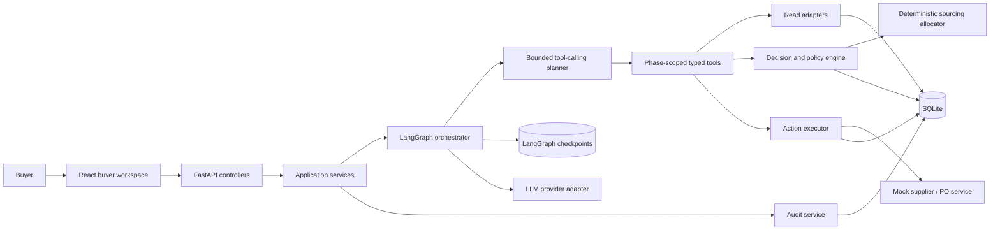
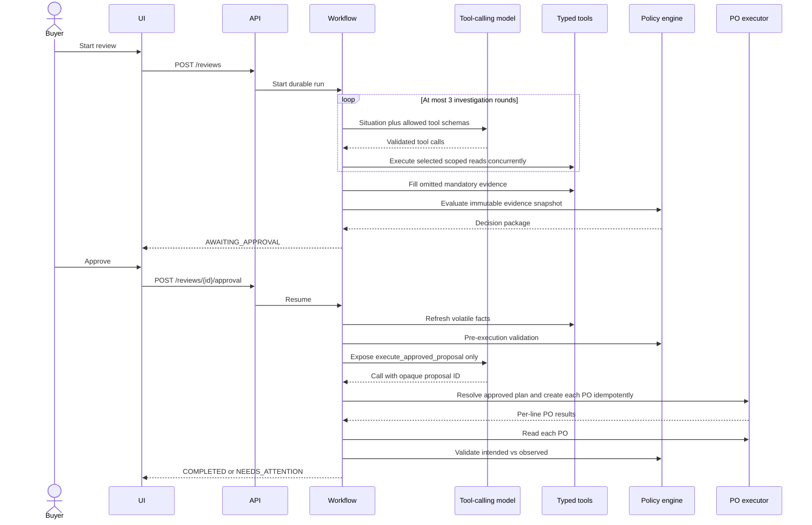

# System Architecture

## 1. Architectural style

Use a modular monolith with ports and adapters. It minimizes setup for the assignment while preserving boundaries that could later become services.



## 2. Responsibility boundaries

| Module | Owns | Must not own |
|---|---|---|
| `api` | HTTP parsing, authentication stub, error mapping | Business decisions |
| `application` | Use-case transactions and orchestration entry points | SQL details or prompts |
| `workflow` | State transitions, bounded model rounds, branching, interrupt/resume, recovery | Quantity or allocation formulas |
| `domain` | Entities, calculations, allocation objective, constraints, reason codes, policies | Framework imports |
| `tools` | Phase-scoped typed functions and mandatory evidence manifest | Raw SQL, unrestricted HTTP, or model-authored write fields |
| `integrations` | Mock ERP/supplier and LLM adapters | Policy decisions |
| `repositories` | Persistence behind typed interfaces | Workflow branching |
| `audit` | Append-only sanitized events | Hidden chain-of-thought |
| `web` | Presentation and buyer interaction | Reimplementing business rules |

## 3. Dependency rule

Dependencies point inward:

```text
api / workflow / integrations / repositories
                  -> application
                  -> domain
```

The domain package imports only the Python standard library and its own types. LangGraph state uses domain DTOs but domain code does not know LangGraph exists.

## 4. Suggested repository shape

```text
.
├── apps/
│   ├── api/
│   │   └── app/
│   │       ├── api/
│   │       ├── application/
│   │       ├── domain/
│   │       ├── workflow/
│   │       ├── tools/
│   │       ├── integrations/
│   │       ├── repositories/
│   │       └── audit/
│   └── web/
│       └── src/
│           ├── api/
│           ├── features/reviews/
│           ├── components/
│           └── routes/
├── tests/
│   ├── unit/
│   ├── integration/
│   ├── contract/
│   └── evaluation/
├── data/seed/
├── spec/
├── .env.example
└── README.md
```

## 5. Runtime sequence



## 6. Deployment topology

MVP runs as two processes and one file-backed database:

- Vite development server or static frontend;
- FastAPI/Uvicorn process containing workflow and mock adapters;
- SQLite database file with a separate checkpoint namespace.

No Redis or worker is required. Long-running work is represented as a durable run and API requests return promptly. If production scale were required, the application boundary permits moving orchestration to workers and PostgreSQL without changing domain policies.

## 7. Architectural risks

| Risk | Control |
|---|---|
| LLM gives plausible but false reason | Explanation receives only typed facts and reason codes; claims are checked |
| Model omits a critical read | Scenario evidence manifest fills the missing tool before policy evaluation |
| Model attempts to alter a PO | Action tool accepts only an opaque approved proposal ID; server reconstructs the request |
| Tool providers unavailable after approval | Preserve approval in `AWAITING_EXECUTION_RETRY`; refresh before retry |
| Evidence changes during approval | Snapshot hash plus pre-execution refresh and recalculation |
| Duplicate write after retry | Unique idempotency key and database constraint |
| Framework couples business logic | Pure domain package and adapter tests |
| Assignment exceeds one day | P0 vertical slice before P1; no infrastructure expansion |
