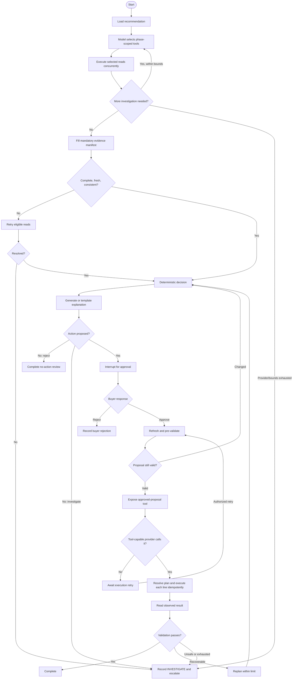

# Agent Workflow Specification

## 1. Workflow state

The LangGraph state is a small set of references and typed outputs, not an ever-growing message transcript:

```text
review_id
workflow_version
recommendation
scenario_type
investigation_trace_id
evidence_snapshot_id
evidence_status
decision_id
proposal_version
sourcing_plan_id
proposal_id
approval_result
action_attempt_ids[]
validation_result_ids[]
recovery_attempts
errors[]
```

Large payloads live in application storage. Nodes return state deltas. Reducers append only where history is required.

## 2. Main graph



## 3. Node contracts

| Node | Input | Output | Failure behavior |
|---|---|---|---|
| `load_recommendation` | review ID | validated recommendation | permanent failure -> `FAILED` |
| `plan_investigation` | scoped situation and allowed schemas | validated tool calls | provider failover; bounds exhaustion -> attention |
| `execute_read_tools` | selected scoped calls | normalized tool results | retain per-tool errors; independent calls concurrent |
| `complete_manifest` | scenario and collected results | mandatory missing reads | invalid/deficient -> investigate |
| `assess_evidence` | evidence results | snapshot and status | deficient -> retry/investigate |
| `calculate_decision` | snapshot | deterministic decision | invalid domain data -> investigate |
| `allocate_suppliers` | need, eligible options, global limits | deterministic sourcing plan | no complete safe plan -> investigate |
| `explain_decision` | closed decision package | typed explanation | fallback template |
| `request_approval` | proposal | durable interrupt payload | waits without holding request |
| `prevalidate_action` | approved proposal | unchanged or new decision | changed -> new approval |
| `invoke_approved_action` | approved proposal ID and sole write schema | validated tool call | providers exhausted -> wait for retry |
| `execute_action` | resolved immutable plan | per-line action attempts/results | transient retry; partial success -> attention |
| `validate_action` | intended plus observed result | validation result | replan or escalate |
| `replan` | mismatch/partial fulfilment | refreshed context | capped recovery count |
| `finalize` | terminal outcome | completed audit event | transactional persistence |

## 4. Human interrupt contract

Interrupt payload contains review ID, decision version, proposal version, snapshot hash, proposed PO fields, calculation summary, constraints, explanation, and expiry time.

Resume payload is one of:

```json
{"decision":"APPROVE","proposal_version":1,"comment":"optional"}
```

```json
{"decision":"REJECT","proposal_version":1,"comment":"required for demo audit"}
```

The resume endpoint authenticates the buyer, confirms the pending proposal version, and records the response before resuming. Model text can never synthesize approval.

## 5. Retry policy

- Investigation: at most 3 model rounds and 10 unique model-selected tool-and-argument pairs. Manifest-added safety reads are audited but do not consume this cap.
- Read tools: at most 2 total attempts per failed call for timeout, connection, or server errors; exponential backoff with small jitter.
- Validation-safe create call: up to 2 retries using the same idempotency key.
- Schema, authorization, not-found, and hard-constraint errors: no retry.
- Workflow recovery/replanning: maximum 2 proposal cycles after the initial action.
- Provider exhaustion, or bounds reached with unresolved mandatory evidence, routes to `NEEDS_ATTENTION` with the last safe state retained.
- Post-approval tool-provider exhaustion routes to `AWAITING_EXECUTION_RETRY`; an authorized retry refreshes evidence before exposing the tool again.

## 6. Partial fulfilment subflow

Input event: PO ordered quantity 500, supplier-confirmed quantity 250.

1. Verify event identity and deduplicate by supplier event ID.
2. Read the current PO and calculate outstanding shortfall.
3. Refresh on-hand, reservations, other incoming supply, revised forecast, budget, capacity, and alternate supplier terms.
4. Recompute target stock and remaining need. Do not assume the missing 250 is still required.
5. If existing coverage is sufficient, accept partial fulfilment and take no new action.
6. If remaining need is positive, compare every eligible supplier and deterministically allocate a complete reliability-first sourcing plan.
7. If evidence is missing, constraints block action, or recovery limit is reached, escalate.
8. Validate every replacement PO through the same main validation path. A partial execution retains successful lines, creates no duplicates, and ends in `NEEDS_ATTENTION`.

## 7. Demand-change subflow

1. Deduplicate and persist the demand signal and its baseline/revised forecast references.
2. Let the bounded investigator select from recent sales, forecasts, inventory, open POs, supplier options, budget, storage, and planning-policy tools.
3. Complete the Scenario 3 mandatory evidence manifest and validate freshness, scope, version ordering, and the configured spike threshold.
4. Recompute coverage using the revised forecast.
5. Complete with no action when current plus eligible incoming supply remains sufficient.
6. Otherwise build a supplemental sourcing plan, request approval, execute, and validate it through the main path.
7. Missing/conflicting evidence, incomplete allocation, or exhausted recovery routes to `NEEDS_ATTENTION`.

## 8. Provider roles

- Investigation/action invocation: Gemini `gemini-3.8-flash`, then Groq `GROQ_AGENT_MODEL` (default `openai/gpt-oss-120b`).
- Explanation: configured explanation order, retaining Groq `groq/compound` and NVIDIA Nemotron support.
- NVIDIA is not included in tool-call failover until its configured model passes the common tool-capability contract tests.
- Explanation failure uses a deterministic template. Investigation failure escalates; post-approval action-invocation failure waits for retry.

## 9. Determinism and replay

Each decision stores workflow version, policy version, evidence snapshot hash, investigation trace, tool result references, allocation-policy version, and prompt/template version. Replaying policy and allocation with the same snapshot MUST reproduce the operational plan. Model tool ordering and wording need not be byte-identical, but mandatory evidence and the final plan must be equivalent.
